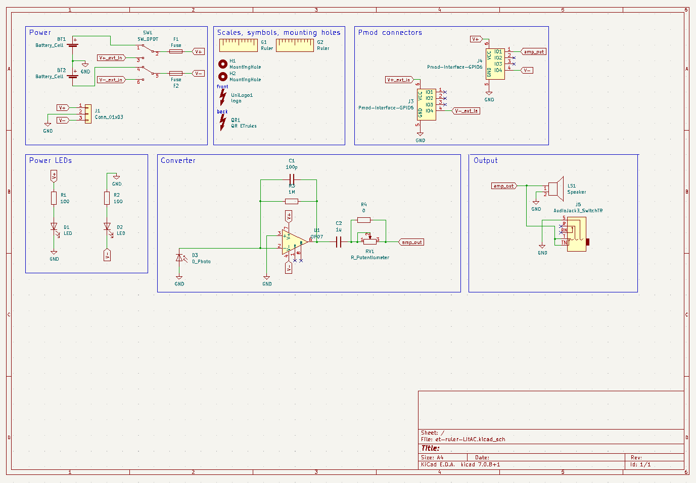
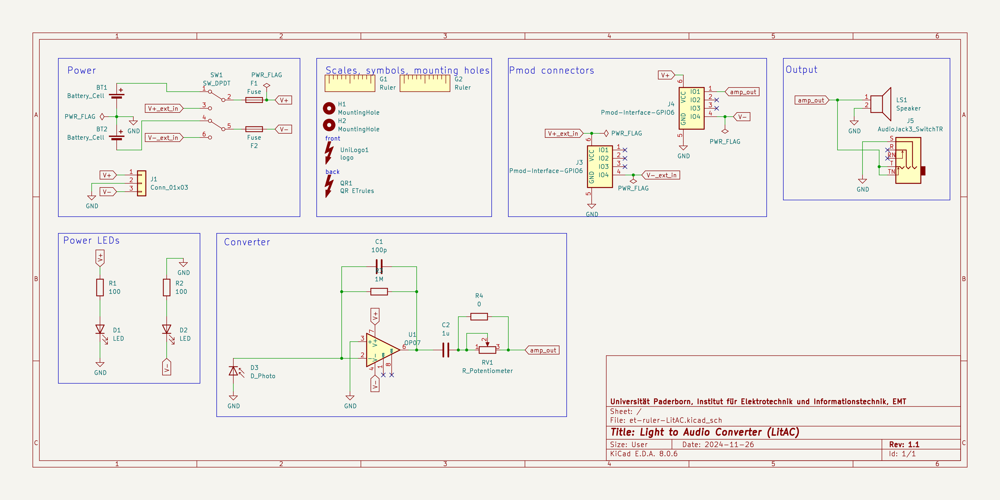

# Light to Audio Converter (LitAC)

Did you ever look at an electrical candle and thought to yourself: "Mhmm, I really wonder what the flickering would sound like if I could hear light"?
With this project you will no longer be in the dark!

A photoresistive diode picks up the flickering of your candle and converts it into an electrical signal. The signal then gets amplified (by an OP07) so you can hear it with your headphones or speakers.
You can connect two "LitAC" to have them powered from the same battery, so you only need two batteries for your candle powered orchestra.

An interactive html bom file with pcb layout and material placement can be found [here](bom/ibom.html).

# Schematic

